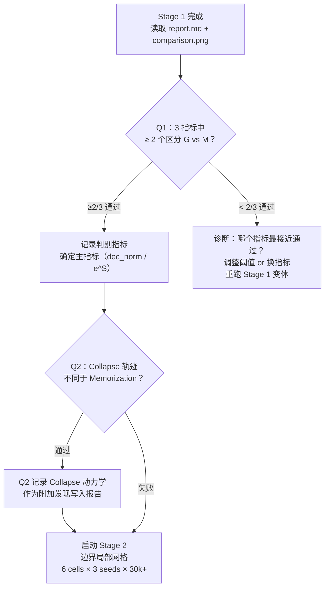

# 实验进度追踪

> [!tip] 导航
> 返回 [[研究总览]] | 详细实验记录见 [[研究说明文档#九、实验执行日志（按时间顺序）]]

---

## 当前状态（2026-04-01）

> [!success] 所有实验已完成，论文 v2 修订完成
> - Sensitivity 分析：✅ 完成（RS=0.94，0/8 ordering flips）
> - 论文修订：✅ 完成（9 处改进 + 3 处硬性矛盾修复）
> - overleaf_upload.zip：✅ 已重建（12 个文件）

---

## 阶段追踪

^stage-tracker

| 阶段 | 内容 | 状态 | 结果摘要 |
|------|------|------|---------|
| Stage 0 v1 | 初始指标验证 | ✅ 废弃 | Procrustes 全零，tau_gen 误定义 |
| Stage 0 v2/v3 | 修复后指标验证 | ✅ 完成 | G<F 确认；Circle Score 永不达标 → Pivot |
| **Stage 1** | 5×5 粗网格（coarse sweep） | ✅ 完成 | G<F 初步，29/75 F_only，G<F 似局限 wd=2.5 |
| **Stage 2** | lr=1.6e-3，wd∈[1.2,3.5]，10×3 | ✅ 完成 | 29/30 G<F；G<F 宽平台（Stage 1 是采样假象） |
| **Stage 3** | wd=2.5，lr∈[5e-4,8e-3]，10×3 | ✅ 完成 | 23/25 G<F；相变 lr≈5e-3；合并 52/55 G<F |
| **Paper v2** | ICLR LaTeX 修订版 | ✅ 完成 | 9处改进 + 3处矛盾修复 |
| **Sensitivity** | 8 cells × 36 detector configs | ✅ 完成 | RS=0.94；0/8 raw/corr flips |

---

## Stage 1 设计（当前实验）

> [!example] 实验设计：同 lr=1.6e-3，仅 wd 变化（单轴对比）
> **seeds** = [42, 7, 2025] | **max_steps** = 50,000 | **log_interval** = 100 步

| Cell | wd | 预期相区 | 预期动力学 |
|------|----|---------|-----------|
| `grokking` | 1.0 | Grokking | ~25k 步泛化；dec_norm 缓慢下降 |
| `memorization` | 0.04 | Memorization | 过拟合；dec_norm 几乎不变 |
| `collapse` | 10.0 | Confusion | 权重快速归零；train_acc 无法提升[^collapse] |

### 新增指标套件

| 指标 | 含义 | 假设判别能力 |
|------|------|------------|
| `dec_norm` | 解码器权重矩阵 L2 范数均值 | **最强**：Grokking↓, Memo 稳定, Collapse→0 |
| `emb_norm` | 嵌入行 L2 范数均值（wd=0） | 辅助：三相增长模式不同 |
| `gen_gap` | test\_nll − train\_nll | 泛化间隙：Grokking 闭合，Memo 不闭合 |
| `train_nll` | 训练损失 | Collapse 无法下降 |
| `F(t)` | 傅里叶对齐 $R^2$ | 已知：$\tau_F > \tau_\text{gen}$ in Grokking |
| `e^S` | 有效维度（MIT 指标） | 已知在泛化时下降 |

### 待回答问题

- [ ] **Q1**：`F(t)`、`e^S`、`dec_norm` 能否在 $\tau_\text{gen}$ 之**前**区分 Grokking vs Memorization？ ^q1
- [ ] **Q2**：`collapse`（wd=10）的 `dec_norm` 轨迹是否与 `memorization`（wd=0.04）截然不同？ ^q2

[^collapse]: 每步权重缩放 = $1 - 1.6\times10^{-3} \times 10 = 0.984$，1000步后剩余 $0.984^{1000} \approx 1.4 \times 10^{-7}$

---

## Stage 0 诊断结果

^stage0-results

> [!bug] Stage 0 失败原因汇总（三次运行）

| 指标 | Stage 0 结果 | 根本原因 |
|------|------------|---------|
| Circle Score > 0.8 | ❌ 永不发生（最高 0.019）| 256D 空间平行四边形测试几何上不可能 |
| F<G<R 顺序 | ❌ 实际 G<F，R 缺失 | 假说方向错误 |
| F(t) 在 Grokking 激活 | ⚠️ 部分（grok\_B 通过）| grok\_A 在 30k 步内 censored |
| τ_F 跨种子稳定 | ⚠️ 部分（grok\_B std=1955 步）| grok\_A 只有 1 颗种子检测到 τ_F |
| Circle Score 初始低 | ✅ 通过 | 无问题 |

---

## 研究方向修正记录

^direction-revision

### 2026-03-28 — 修正

> [!warning] 原假设已被推翻
> **原假设**：$\tau_F < \tau_\text{gen} < \tau_\text{ring}$（傅里叶先→泛化→环形）
>
> **实验推翻**：
> - $\tau_\text{gen} < \tau_F$（泛化先于傅里叶可测，差值约 +1100 步）
> - $\tau_\text{ring}$ 永远不存在（Circle Score 从不触发）

**新核心问题**：哪些内部指标能在相图中稳定地**区分** Grokking 和 Memorization？

**理论支撑**（Musat 2025，arXiv 2511.01938）：weight decay 最终迫使解码器权重范数减小，嵌入被迫形成结构化表示。预测 `dec_norm` 是比 $F(t)$ 更直接、更早的判别信号。

---

## 已排除的超参数区域

^excluded-configs

> [!failure] Comprehension 相区不存在于此配置
> 穷举测试 **14 个候选点**，无一出现 Comprehension。

| 搜索区域 | lr | wd | 结果 |
|---------|----|----|------|
| 高 wd（左簇扩展）| 1.6e-3 | 12–30 | 权重崩塌 / Confusion |
| 高 lr + 中等 wd | 5e-2–2e-1 | 0.5–3.0 | 极速过拟合（Memorization） |
| 中间 lr | 4e-3 | 10–20 | Confusion |
| 右簇高 wd | 1e-2 | 10–20 | Confusion |

**推测原因**：$p=53$ 时训练样本约 840 个（$p=97$ 时约 2800 个），模型容量相对过剩，Comprehension 相区消失。==此发现将在论文中单独报告。==

---

## Stage 1 后续决策路径

^decision-rules

### Q1 判定：指标是否区分 Grokking vs Memorization？

> [!info] 规则：**3 个指标中至少 2 个**方向一致，Q1 才通过

| 指标 | 通过条件 | 计算方式 |
|------|---------|---------|
| `dec_norm` | $\text{dec\_norm}_G^\text{final} \;/\; \text{dec\_norm}_M^\text{final} < 0.7$ | 取 3 seeds 中位数比值 |
| `e^S` | $e^S_G^\text{final} \;/\; e^S_G^\text{init} < 0.6$，且 $e^S_M$ 无此幅度下降 | 各自相对变化量对比 |
| `gen_gap` 闭合比例 | $r_G = \text{gap}_G^\text{final} \;/\; \text{gap}_G^\text{init} < 0.3$，且 $r_M > 0.7$ | 初始值取第 500 步，终值取最后 500 步均值 |

**Q1 = PASS**：上述 3 项中 ≥ 2 项通过，且方向一致（即指向同一结论：Grokking 有结构化而 Memorization 无）

### Q2 判定：Collapse 轨迹是否不同于 Memorization？

> [!info] 规则：轨迹形态判定，而非最终值比较

| 轨迹特征 | Memorization 预期 | Collapse 预期 | 通过条件 |
|---------|-----------------|--------------|---------|
| `dec_norm` 斜率 | 缓慢变化（\|slope\| < 0.01/step） | 前 2k 步内快速归零 | collapse 前 2k 步均值 < 0.1 × memo 前 2k 步均值 |
| `train_acc` 曲线形态 | 单调上升至 ≥0.9 | 停滞或上升后回落 | collapse 在 10k 步时 train_acc < 0.5 |
| `gen_gap` 轨迹 | 先大后稳定（过拟合） | 无意义（两者均低）| collapse 的 train_nll 在 5k 步时仍 > 3.5 |

**Q2 = PASS**：上述 3 项轨迹特征中 ≥ 2 项符合预期

### Stage 2 设计（Q1 通过后自动触发）

> [!example] 边界局部网格，而非全 5×5
> 锚定已知 Grokking 左簇（lr=1.6e-3），沿 wd 轴在 **Grokking/Memorization 相界两侧各取 3 个点**

| 维度 | 取值 | 依据 |
|------|------|------|
| lr | 固定 1.6e-3 | 左簇中心，已确认 |
| wd（Memorization 侧）| 0.01, 0.02, 0.04 | 已知 wd < 0.04 → Memo |
| wd（Grokking 侧）| 0.25, 1.0, 2.5 | 已知 wd ∈ [0.63, 2.5] → Grokking |
| seeds | 42, 7, 2025 | 每点 3 seeds |
| **总计** | **6 cells × 3 seeds = 18 runs** | |

目的：精确定位 Grokking/Memorization 相界，测量判别指标在边界处的梯度。

### 每 run 步数：30k + 自动延长

> [!note] 自动延长条件
> 基准 30k 步完成后，检查以下条件：
> - **延长至 50k**：tau_gen 未检测到（test_acc 从未达到 0.9），且 train_acc > 0.9（说明仍在 Grokking 过程中）
> - **继续至 80k**：50k 时 tau_gen 仍未出现，且 train_acc > 0.9 仍维持（稀有的慢 Grokking）
> - **停止**：train_acc < 0.9（Confusion），或 tau_gen 已确认，或 dec_norm < 0.01（Collapse）

### 决策流程图

---

## 代码文件现状（2026-03-31）

| 文件 | 用途 | 状态 |
|------|------|------|
|  | 基线训练脚本 | 稳定 |
|  | 统一指标工具库（canonical） | 稳定 |
|  | Stage 0 指标验证 | 完成 |
|  | Stage 1 5×5 粗网格 | 完成 |
|  | Stage 2 wd 细扫 | 完成 |
|  | Stage 3 lr 细扫 | 完成 |
|  | Detector 敏感性分析 | **运行中** |
|  | ICLR 论文正文 | 完成（初稿） |
|  | 参考文献（7 条已验证） | 完成 |

## 最新数值结果汇总

| 实验 | 总 Grokking | G<F | F<G | coincident |
|------|------------|-----|-----|-----------|
| Stage 2（wd 轴） | 30/30 | 29 (97%) | 0 | 1 |
| Stage 3（lr 轴） | 25/30 | 23 (92%) | 2 | 0 |
| **合计** | **55** | **52 (94.5%)** | **2 (3.6%)** | **1 (1.8%)** |

**median Δ = τ_F − τ_gen（G<F runs）：** 约 8,000 步（范围 2,000–25,500 步）
