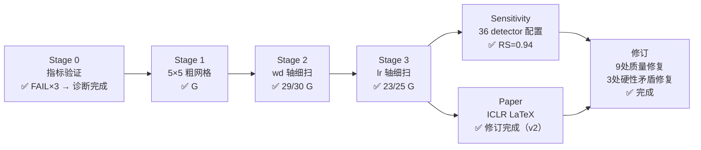

# The Ring Is Not the Algorithm — 研究总览

> [!abstract] 核心论点（已更新 2026-04-01）
> 在 Transformer grokking 中，**泛化（$\tau_\text{gen}$）先于 token embedding 的 Fourier 对齐（$\tau_F$）出现**，Δ = τ_F − τ_gen ≈ 8,000 步（中位数），在 lr 和 wd 两轴上均为宽平台（94.5% G<F，55 次 Grokking runs）。36 种 detector 配置下 RS=0.94，结论稳健。可见的 PCA 环形结构是事后整理的产物。

---

## 导航

### 核心文档
- [[研究说明文档]] — 完整研究记录（背景、方法、实验日志）
- [[实验进度]] — 当前进度追踪 & 决策门槛

### 参考材料
- [[研究说明文档-思维导图]] — Canvas 思维导图

### 代码文件（`base/` 目录）

| 文件 | 用途 | 状态 |
|------|------|------|
| `grokking_baseline.py` | 基线训练脚本 | 稳定 |
| `stage0_metric_validation.py` | Stage 0 指标验证 | 已完成 |
| `stage1_phase_dynamics.py` | **Stage 1 相动力学对比** | ⏳ 运行中 |

---

## 研究问题

在 $(decoder\_lr,\; decoder\_wd)$ 超参数相图中，token embedding 的可见环形结构相对于泛化的**时序关系**是什么？

$$\tau_\text{Fourier} \quad \text{vs} \quad \tau_\text{gen} \quad \text{vs} \quad \tau_\text{ring}$$

---

## 模型规格

^model-spec

| 参数 | 值 |
|------|----|
| 素数 $p$ | 53 |
| $d_\text{model}$ | 256 |
| $n_\text{layers}$ / $n_\text{heads}$ | 2 / 4 |
| 架构 | Decoder-only Transformer |
| 嵌入 lr / wd | 1e-3 / 0（固定） |
| 解码器 lr 扫描 | $[3\times10^{-7},\; 4\times10^{-2}]$ 对数均匀 |
| 解码器 wd 扫描 | $[10^{-2},\; 30]$ 对数均匀 |

---

## 实验阶段总览

### 阶段状态

| 阶段 | 内容 | 状态 | 关键发现 |
|------|------|------|---------|
| **Stage 0 v1** | 初始指标验证 | ✅ 废弃 | Procrustes R² 全零、tau_gen 误定义 |
| **Stage 0 v2/v3** | 修复后重跑 | ✅ 完成 | G<F 顺序确认；Circle Score 永不达标 → 研究 pivot |
| **Stage 1** | 5×5 粗网格（25 cells × 1 seed） | ✅ 完成 | G<F 初步信号，29/75 F_only |
| **Stage 2** | lr=1.6e-3，wd∈[1.2,3.5]，10×3 | ✅ 完成 | 29/30 G<F；G<F 是 wd 轴宽平台 |
| **Stage 3** | wd=2.5，lr∈[5e-4,8e-3]，10×3 | ✅ 完成 | 23/25 G<F；相变在 lr≈5e-3 |
| **Sensitivity** | 8 cells × 36 detector 配置 | ✅ 完成 | RS=0.94；0/8 raw/corr flips |
| **Paper v2** | ICLR LaTeX 修订版 | ✅ 完成 | 9处改进 + 3处硬性矛盾修复 |

---

## 关键发现（截至 2026-04-01）

^key-findings

> [!warning] 研究 Pivot（2026-03-28）
> 原假设 $\tau_F < \tau_\text{gen} < \tau_\text{ring}$ **未得到确认**。
> Circle Score 在全部 93 次 50k 步 runs 中从未达到 0.8 阈值（最高值 ~0.019）。
> **研究问题 pivot 为：embedding Fourier 对齐是否出现在泛化之前或之后？**

> [!success] 主要发现（Stage 2 + Stage 3，55 次 Grokking runs）
> **G<F 是跨 lr 和 wd 两轴的宽平台：**
> - Stage 2（wd 轴）：29/30 G<F，Δ 中位数 5,500–13,000 步
> - Stage 3（lr 轴）：23/25 G<F，Δ 中位数类似
> - 合并：52/55 G<F（94.5%），2 F<G，1 coincident
>
> **三阶段 Grokking 图景：**
> 机制形成（0→τ_gen）→ 泛化突破（τ_gen）→ embedding 几何整合（τ_gen→τ_F）

> [!danger] 相图发现
> 在 $p=53$、$d=256$、train\_frac=0.3 配置下，**Comprehension 相区不存在**。
> 仅有 Grokking 和 Memorization/Confusion 两相区。

> [!info] 方法论关键（已由敏感性分析验证）
> 零假设修正（null-corrected Fourier）的作用已由实验厘清：
> - raw 和 corrected 对 |Δ|≥3k steps 的 cell **给出相同 ordering**（0/8 flips）
> - null correction 的价值在于防止 coincident 边界附近的高维偶然对齐产生误报（概念校准）
> - G<F 结论不依赖 null correction 的选择（RS=0.94 在 36 种 detector 配置下稳健）

---

## 下一步

> [!success] 当前状态（2026-04-01）：论文准备就绪
> 所有实验完成，论文已修订，overleaf_upload.zip 已重建。
> 可选后续方向：
> 1. （可选）2D (lr, wd) 网格细扫，验证 G<F 在整个 Grokking 区的分布
> 2. （可选）Nanda-style progress measures 对比实验
> 3. （待定）提交导师审阅

---

## 相关文献

| 论文 | 贡献 | 与本研究的关系 |
|------|------|--------------|
| Power et al. 2022 | Grokking 现象发现 | 任务基础 |
| Liu et al. 2022[^liu2022] | MIT 四相图 | 相图设计来源 |
| Nanda et al. 2023[^nanda2023] | Fourier 电路 | F(t) 指标设计基础 |
| Musat 2025[^musat2025] | 范数最小化→环形 | dec_norm 假说来源 |
| He et al. 2026 | Fourier 竞争理论 | 两相模型理论支撑 |

[^liu2022]: "Towards Understanding Grokking: An Effective Theory of Representation Learning"
[^nanda2023]: "Progress measures for grokking via mechanistic interpretability"
[^musat2025]: arXiv 2511.01938
