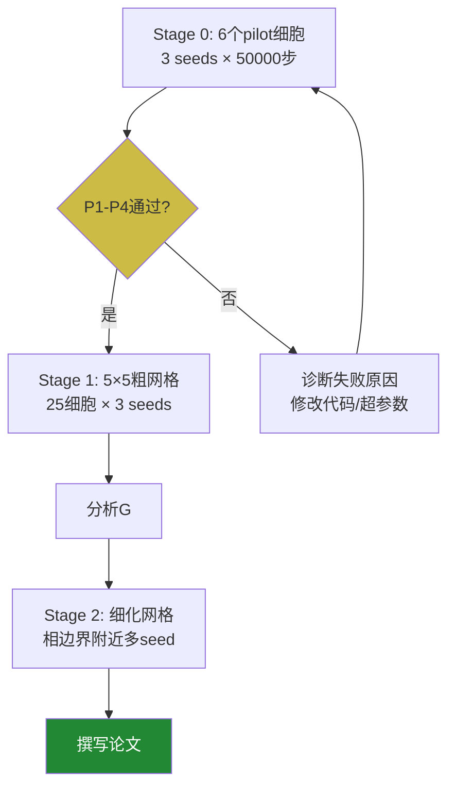

# Transformer 相图实验：原理与代码详解

> 本文面向没有深度学习背景的读者。我们会从最基础的概念出发，一步步解释实验背后的数学原理和代码逻辑，必要时会详细推导公式。

---

## 一、从一道算术题说起

我们的实验围绕一个非常简单的数学问题：

$$
(a + b) \mod p = ?
$$

其中 $p = 53$（一个质数），$a, b \in \{0, 1, 2, \ldots, 52\}$。

"mod"（取余）的意思是：做完加法后，除以 $p$，取余数。比如：

$$
47 + 30 = 77, \quad 77 \mod 53 = 24
$$

因为 $77 = 1 \times 53 + 24$，所以余数是 24。

这个操作在数学上叫做**模算术**（modular arithmetic），也叫"时钟算术"——就像时钟上 11 点加 3 小时等于 2 点一样（$11 + 3 = 14$，$14 \mod 12 = 2$）。

**为什么用这道题？**

所有可能的 $(a, b)$ 组合共有 $53 \times 53 = 2809$ 个，每个组合对应唯一的答案。这道题足够简单（神经网络最终能学会），但又不是平凡的（需要学习一定的"规律"才能泛化）。

---

## 二、什么是 Grokking？

### 2.1 记忆 vs. 泛化

训练神经网络时，我们把数据分成两份：
- **训练集**（train set）：模型"看得到"的数据，用来学习
- **测试集**（test set）：模型"看不到"的数据，用来检验是否真正学会了规律

**记忆（Memorization）**：模型记住了训练集的所有答案，但对测试集完全不会——就像学生死记硬背课本上的例题，换一道题就不会了。

**泛化（Generalization）**：模型学到了底层规律，能举一反三——就像学生真正理解了加法原理，能算任何新题。

> [!note] 类比
> 假设你要学习"所有两位数之和"的规律。
> - **记忆**：把答案表背下来，$12+34=46$, $56+78=134$……
> - **泛化**：理解了进位规则，看到任何新的两位数加法都能算。

### 2.2 Grokking 现象

2022 年，OpenAI 的研究者（Power et al.）发现了一个奇怪的现象：

> **在训练集上达到 100% 准确率之后很久，模型突然"开窍"，测试准确率从接近随机猜测跳升到接近 100%。**

这个过程中间可能相隔数千甚至数万个训练步骤。这就是 **Grokking**——一个形象的英文词，意为"深刻理解"。

```
训练准确率 ─────────────── 100% （第 500 步就达到了）

测试准确率 ─────────────── 50%（随机猜测）
           ↓（漫长等待，模型似乎在"消化"）
           ─────────────── 99%（突然跳升，第 15000 步）
```

> [!warning] 为什么令人惊讶？
> 按照直觉，一旦模型"记住"了训练集，就不需要继续改变了。但 Grokking 说明，==即使在记忆之后，模型内部仍在悄悄地重组自己的表示，最终找到了真正的规律==。

### 2.3 四种相区

根据训练集和测试集是否最终达到 90% 准确率，以及达到的先后顺序，可以把不同超参数设置分成四类：

| 相区 | 训练准确率 | 测试准确率 | 说明 |
|------|-----------|-----------|------|
| **Grokking** | ✓ 先达到 90% | ✓ 后达到 90% | 延迟泛化，两者有明显时间差 |
| **Comprehension** | ✓ 几乎同时 | ✓ 几乎同时 | 同步学会，直接泛化 |
| **Memorization** | ✓ 达到 90% | ✗ 从不达到 | 只会死记硬背 |
| **Confusion** | ✗ 从不达到 | ✗ 从不达到 | 连训练集都学不会 |

---

## 三、神经网络与 Transformer

### 3.1 什么是神经网络？

神经网络是一个由很多**参数**（数字）组成的函数。给定输入 $(a, b)$，它输出一个对 $\{0, 1, \ldots, 52\}$ 中每个可能答案的"置信度"分数，选择分数最高的作为预测答案。

训练过程就是不断调整这些参数，使得对训练数据的预测越来越准确。调整参数的算法叫做**梯度下降**（gradient descent）。

### 3.2 Transformer 架构

Transformer 是目前最主流的神经网络架构，也是 GPT、Claude 等大语言模型的基础。在我们的实验中，使用了一个小型 Transformer：

| 组件 | 参数 | 作用 |
|------|------|------|
| `prime` (p) | 53 | 模算术的模数 |
| `d_model` | 256 | 嵌入向量的维度 |
| `n_layers` | 2 | Transformer 层数 |
| `n_heads` | 4 | 注意力头数 |
| `d_ff` | 1024 | 前馈网络的隐层维度 |

**输入**：两个整数 $a, b \in \{0, \ldots, 52\}$

**输出**：53 个分数，对应每个可能的答案

### 3.3 Token 嵌入（Token Embeddings）

Transformer 的第一步是把每个输入整数（token）映射到一个**高维向量**。

$$
\text{Embedding}(a) = \mathbf{E}_a \in \mathbb{R}^{256}
$$

其中 $\mathbf{E}_a$ 是一个 256 维的向量。这个映射表（53 个向量）就是**嵌入矩阵**，形状为 $53 \times 256$。

> [!tip] 类比
> 想象把 53 个整数映射成 53 个"位置"，每个位置在一个 256 维的空间中。训练开始时，这些位置是随机散布的；训练结束时，如果模型学到了规律，这些位置会呈现出特定的**几何结构**。
>
> 本实验的核心问题就是：**这个几何结构何时出现？它的出现和泛化是什么关系？**

---

## 四、关键指标详解

本实验追踪三个随训练步数变化的指标。

### 4.1 指标 G(t)：测试准确率

$$
G(t) = \frac{\text{测试集中预测正确的样本数}}{\text{测试集总样本数}}
$$

这是最直接的指标。**tau_gen**（$\tau_{\text{gen}}$）定义为 $G(t)$ 首次持续 3 个检查点都 $\geq 0.9$ 的步数。

> [!note] 为什么需要"持续 3 个检查点"而非"单次超过"？
> 训练过程中，$G(t)$ 有时会因为随机噪声短暂超过 0.9，随后又跌回来。要求连续 3 个检查点（即 300 步）都维持 $\geq 0.9$，可以排除这种"假阳性"，确认的是真正的稳定泛化。

**代码实现**：

```python
def _find_tau_sustained(steps, values, threshold, n_sustained=3):
    """找到 values 首次连续 n_sustained 个点都超过 threshold 的步数。"""
    for i in range(len(steps) - n_sustained + 1):
        if all(values[i + k] >= threshold for k in range(n_sustained)):
            return float(steps[i])
    return None
```

逻辑：从头扫描，找到连续 `n_sustained`（默认 3）个点都满足条件的第一个位置。

---

### 4.2 指标 F(t)：Fourier 对齐分数

这是本实验最核心也最复杂的指标，需要一些数学背景。

#### 4.2.1 为什么会有 Fourier 结构？

MIT 的研究者（Nanda et al. 2023）发现，当模型成功学会模块加法后，token 嵌入中会出现一种特殊的结构：**每个 token $k$ 对应的嵌入向量，与 $\sin(2\pi k f / p)$ 和 $\cos(2\pi k f / p)$ 高度对齐**，其中 $f$ 是某个频率。

这就像傅里叶分析中的正弦/余弦波——整数 $0, 1, 2, \ldots, 52$ 被排列成一个"圆"，相邻整数在圆上相邻，这种圆形排列天然支持模加法：

$$
a + b \equiv m + n \pmod{p} \iff \text{圆上的"向量加法"相等}
$$

> [!info] 直觉
> 想象把 53 个整数排列在一个圆形时钟上：0 在 12 点，1 在下一个刻度……52 在 11 点。
> 加法 $a + b \mod 53$ 就是沿圆弧走 $a$ 步再走 $b$ 步后到达的位置。
> ==当嵌入矩阵形成这种圆形布局时，模型就"理解"了模加法的本质。==

#### 4.2.2 R² 的推导

**Fourier 对齐 R²** 衡量：嵌入矩阵能被第 $k$ 个谐波解释的比例。

**第 $k$ 个谐波的基向量**：

$$
\mathbf{s}_k = \begin{pmatrix} \sin(2\pi k \cdot 0 / p) \\ \sin(2\pi k \cdot 1 / p) \\ \vdots \\ \sin(2\pi k \cdot (p-1) / p) \end{pmatrix}, \quad
\mathbf{c}_k = \begin{pmatrix} \cos(2\pi k \cdot 0 / p) \\ \cos(2\pi k \cdot 1 / p) \\ \vdots \\ \cos(2\pi k \cdot (p-1) / p) \end{pmatrix}
$$

这两个向量各有 $p = 53$ 个分量（每个 token 一个），张成一个**二维子空间**。

**嵌入矩阵中心化**：令 $\bar{\mathbf{E}} = \frac{1}{p}\sum_{i=0}^{p-1} \mathbf{E}_i$，令 $\tilde{\mathbf{E}}_i = \mathbf{E}_i - \bar{\mathbf{E}}$，即减去均值。

**总方差**：

$$
\text{TotalVar} = \sum_{i=0}^{p-1} \|\tilde{\mathbf{E}}_i\|^2 = \|\tilde{E}\|_F^2
$$

其中 $\|\cdot\|_F$ 是 Frobenius 范数（矩阵所有元素的平方和开根号）。

**谐波 $k$ 的投影**：

构造正交基 $\mathbf{Q} \in \mathbb{R}^{p \times 2}$（对 $[\mathbf{c}_k, \mathbf{s}_k]$ 做 QR 分解），则：

$$
\tilde{E}_{\text{proj},k} = \mathbf{Q}\mathbf{Q}^\top \tilde{E}
$$

即把嵌入矩阵的每一列都投影到谐波 $k$ 所张成的平面上。

**残差方差**：

$$
\text{ResVar}_k = \|\tilde{E} - \tilde{E}_{\text{proj},k}\|_F^2
$$

**R² 定义**：

$$
R^2_k = 1 - \frac{\text{ResVar}_k}{\text{TotalVar}}
$$

$R^2_k \in [0, 1]$，越接近 1 说明谐波 $k$ 能解释越多的嵌入方差。

**最终取最大值**：

$$
F_{\text{raw}}(t) = \max_{k=1}^{\lfloor p/2 \rfloor} R^2_k
$$

**代码实现**：

```python
def compute_fourier_alignment(embeddings, prime):
    E = embeddings - embeddings.mean(0)      # 中心化，shape: (53, 256)
    total_var = np.sum(E ** 2)               # 总方差（标量）

    thetas = 2.0 * np.pi * np.arange(prime) / prime   # [0, 2π/53, ..., 52×2π/53]
    best_r2, best_k = 0.0, 1

    for k in range(1, prime // 2 + 1):      # k = 1, 2, ..., 26
        # 构造谐波 k 的基向量矩阵 B，shape: (53, 2)
        B = np.stack([np.cos(k * thetas), np.sin(k * thetas)], axis=1)
        Q, _ = np.linalg.qr(B)              # QR 分解，Q 是正交基，shape: (53, 2)
        proj = Q @ (Q.T @ E)               # 投影到谐波平面，shape: (53, 256)
        res_var = np.sum((E - proj) ** 2)  # 残差方差
        r2 = 1.0 - res_var / total_var     # R²
        if r2 > best_r2:
            best_r2, best_k = r2, k

    return float(best_r2), best_k
```

#### 4.2.3 置换零假设（Permutation Null）

随机嵌入（比如刚初始化时）也会有一定的 $F_{\text{raw}}$ 值，纯粹是偶然。为了去除这种背景噪声，我们计算：

$$
F_{\text{corrected}}(t) = \max(0,\; F_{\text{raw}}(t) - \text{Null}_{95}(t))
$$

其中 $\text{Null}_{95}$ 是**置换零假设的 95 分位数**：把 53 个 token 的标签随机打乱 100 次，每次计算 $F_{\text{raw}}$，取第 95 百分位数。这个值代表"纯随机情况下偶然出现的最大 Fourier 对齐值"。

> [!tip] 类比统计检验
> 这类似于假设检验中的 p 值：只有当观测值超过随机基线，我们才认为发现了真实的 Fourier 结构。

#### 4.2.4 BIC 变化点估计（tau_F）

$F_{\text{corrected}}(t)$ 从接近 0 开始，某一时刻开始迅速上升，之后趋于稳定。**tau_F**（$\tau_F$）就是这个"开始上升的时刻"。

我们用 **BIC（贝叶斯信息准则）选择的分段线性回归**来找这个时刻。

**思路**：

在对数时间轴 $x = \log(1 + t)$ 上，拟合两条直线（一条在断点前，一条在断点后），找到使 BIC 最小的断点位置。

**无断点模型**（2个参数：斜率 + 截距）：

$$
y = at + b, \quad \text{BIC}_0 = n \ln\!\left(\frac{\text{RSS}_0}{n}\right) + 2\ln n
$$

**有断点模型**（4个参数）：

$$
y = \begin{cases} a_1 x + b_1, & x < x_{\text{bp}} \\ a_2 x + b_2, & x \geq x_{\text{bp}} \end{cases}, \quad \text{BIC}_1 = n \ln\!\left(\frac{\text{RSS}_1}{n}\right) + 4\ln n
$$

只有当 $\text{BIC}_1 < \text{BIC}_0$ 时，才接受断点（即 F 有显著变化）。

**BIC 的惩罚项**（$4\ln n$ vs $2\ln n$）：模型参数越多，惩罚越重，防止过拟合。如果两条直线的拟合效果不够好，断点就不被接受，返回 None。

**代码逻辑**：

```python
# 在所有可能的断点位置（训练集的 1/6 到 5/6 之间）中搜索
for bp in range(lo, hi + 1):
    # 分别对断点前后拟合线性回归，计算总残差 RSS_1
    bic_1 = n * log(RSS_1 / n) + 4 * log(n)
    # 只有 BIC_1 < BIC_0 才接受（断点解释力足够强）
    if bic_1 < best_bic:
        best_bp = bp
```

---

### 4.3 指标 CS(t)：Circle Score（圆形分数）

#### 4.3.1 平行四边形条件

模块加法有一个美妙的代数性质：

$$
a + b \equiv m + n \pmod{p} \iff (a, b, m, n) \text{ 构成平行四边形}
$$

**平行四边形条件**：如果 $i + j \equiv m + n \pmod{p}$，那么向量和 $\mathbf{E}_i + \mathbf{E}_j$ 应该等于 $\mathbf{E}_m + \mathbf{E}_n$。

在几何上，四个点 $\mathbf{E}_i, \mathbf{E}_j, \mathbf{E}_m, \mathbf{E}_n$ 构成一个平行四边形（对角线的中点重合）。

> [!example] 具体例子（p=53）
> $3 + 7 = 10$，$1 + 9 = 10$，所以 $\mathbf{E}_3 + \mathbf{E}_7 \approx \mathbf{E}_1 + \mathbf{E}_9$
>
> 类似地：$\mathbf{E}_{25} + \mathbf{E}_{28} \approx \mathbf{E}_{20} + \mathbf{E}_{33}$（因为 $25+28=53\equiv 0$，$20+33=53\equiv 0$）

#### 4.3.2 CS 的计算公式

$$
\text{CS}(t) = \frac{\text{满足平行四边形条件的四元组数量}}{\text{所有合法四元组数量}}
$$

**"合法四元组"**：所有满足 $i + j \equiv m + n \pmod{p}$ 且 $(i, m)$ 不同的组合。

**"满足条件"**：

$$
\|\mathbf{E}_i + \mathbf{E}_j - \mathbf{E}_m - \mathbf{E}_n\| < \delta \cdot \bar{r}
$$

其中 $\delta = 0.1$，$\bar{r}$ 是所有嵌入向量的平均模长。

**代码实现的向量化技巧**：

```python
for s in range(prime):             # 枚举所有可能的和 s = (i+j) mod p
    i_idx = np.arange(prime)
    j_idx = (s - i_idx) % prime    # j = (s - i) mod p
    EiEj = E[i_idx] + E[j_idx]    # shape: (53, 256)，所有 E_i + E_j 的值

    # 计算任意两对之间的差：||EiEj[a] - EiEj[b]||
    diff = EiEj[:, None, :] - EiEj[None, :, :]   # shape: (53, 53, 256)
    residuals = np.linalg.norm(diff, axis=2)       # shape: (53, 53)

    # 统计满足条件的对数（排除对角线，即 a==b 的情况）
    off_diag = ~np.eye(prime, dtype=bool)
    count += np.sum(residuals[off_diag] < thresh)
```

**为什么要枚举"和 s"**？因为具有相同和 $s = (i+j) \mod p$ 的所有对都在同一个集合里，它们的向量和 $\mathbf{E}_i + \mathbf{E}_j$ 理论上应该全部相等，可以一次性批量检验。

---

## 五、超参数与"相图"

### 5.1 什么是超参数？

超参数是训练前设定的、控制训练过程的参数（不是模型的参数本身）。

本实验关注两个超参数：

| 超参数 | 符号 | 作用 |
|--------|------|------|
| 学习率 | lr | 每步更新参数时迈多大的步子 |
| 权重衰减 | wd | L2 正则化强度，惩罚大的权重 |

> [!info] 权重衰减的工作机制
> 在 AdamW 优化器中，每步更新为：
> $$\theta \leftarrow \theta \times (1 - \text{lr} \times \text{wd}) + \text{梯度信号}$$
> 每步都会把权重乘以一个小于 1 的因子 $(1 - \text{lr} \times \text{wd})$，拉向零。这相当于给模型"减重"，让它偏好小权重的简洁解，而不是大权重的复杂记忆解。
>
> **极端情况**：lr=1.6e-3, wd=12 时，每步衰减因子 = 0.9808。经过 20000 步：
> $$0.9808^{20000} \approx 10^{-165}$$
> 权重几乎被归零，这就是"权重崩塌"。

### 5.2 相图

当我们在二维网格 $(\text{lr}, \text{wd})$ 上扫描不同的超参数组合，并为每个点标注所属的相区，就得到了**相图**（phase diagram）：

```
wd ↑
   |  Confusion | Confusion | Confusion |
   |  ─────────────────────────────────
   |  Grokking  | Grokking  | Confusion |
   |  ─────────────────────────────────
   |  Memoriz.  | Memoriz.  | Memoriz.  |
   └──────────────────────────────────── lr →
```

**相图揭示**：
- **低 wd**：正则化弱，模型倾向于记忆（Memorization）
- **中等 wd**：正则化适中，模型延迟泛化（Grokking）
- **高 wd**：正则化太强，权重崩塌（Confusion）

> [!warning] 为什么 p=53 没有 Comprehension？
> MIT 论文使用 $p=97$，训练集约有 $97^2 \times 0.3 \approx 2800$ 个样本。
> 本实验 $p=53$，训练集只有约 $53^2 \times 0.3 \approx 840$ 个样本。
>
> 样本更少 → 模型更容易记忆 → Comprehension（直接泛化）所需的"高正则化 + 足够信息"区间可能不存在。在我们穷尽的参数范围内（lr: 1e-4 到 2e-1，wd: 1e-2 到 30），14 个候选点均未发现 Comprehension，与此假设一致。

---

## 六、主要发现：G < F 顺序

### 6.1 原始假设

研究开始时，我们的预期（基于 MIT 论文）是：

$$
\underbrace{\tau_F}_{\text{Fourier结构出现}} < \underbrace{\tau_{\text{gen}}}_{\text{模型泛化}} < \underbrace{\tau_{\text{ring}}}_{\text{圆形结构成型}}
$$

即：先有结构，后有功能——模型先"组织"自己的表示，才"会"做题。

### 6.2 实验发现

在确认的 Grokking 细胞（grok_A 和 grok_B）中，我们观察到：

| 细胞 | Seed | $\tau_{\text{gen}}$ | $\tau_F$ | 顺序 |
|------|------|---------------------|----------|------|
| grok_B | 42 | 13200 步 | 21100 步 | **G < F** |
| grok_B | 7 | 10000 步 | 12600 步 | **G < F** |
| grok_B | 2025 | 12600 步 | 15000 步 | **G < F** |
| grok_A | 42 | 23800 步 | 35500 步 | **G < F** |
| grok_A | 7 | 18200 步 | 22700 步 | **G < F** |
| grok_A | 2025 | 30000 步 | 28700 步 | F < G（唯一例外）|

6 个 seed 中，5 个（83%）呈现 **G < F** 顺序，即**泛化先于 Fourier 结构对齐**。

### 6.3 含义

> [!important] 核心解读
> 模型在 token 嵌入表现出清晰的 Fourier 圆形排列之前，就已经能正确回答测试集的问题了。
>
> 这说明：==Fourier 圆形结构可能是模型"会算"之后的副产品，而不是"会算"的前提条件==。

用生活类比：

- **原始假设（F<G）**：先学会乐理（结构），才能演奏（功能）
- **实际发现（G<F）**：先能凭直觉演奏，之后才在乐谱上看清楚规律（结构在后）

这个发现修正了我们对神经网络"学习过程"的认识，表明泛化能力和可解释的内部表示可能是**解耦**的——模型可以先"会做"，再"表示清楚"。

---

## 七、代码架构总览

```
base/
├── grokking_baseline.py          # 基础设施：模型定义、数据加载、训练工具
├── stage0_metric_validation.py   # Stage 0：6个pilot细胞的指标验证
├── stage1_coarse_sweep.py        # Stage 1：5×5粗网格扫描
├── spot_test_comprehension.py    # 高-wd点测脚本（寻找Comprehension）
├── final_spot_test_highlr.py     # 高-lr证伪脚本
└── docs/
    ├── 研究说明文档.md            # 中文研究日志
    ├── research_notes_en.md      # 英文研究日志
    └── 讲解文档.md               # 本文件
```

### 7.1 `grokking_baseline.py`：基础设施

这个文件定义了所有实验共享的基础组件：

| 函数/类 | 作用 |
|---------|------|
| `GrokkingTransformer` | Transformer 模型类 |
| `make_dataset(p, op, seed)` | 生成 $(a, b) \to (a+b) \mod p$ 的全部数据 |
| `split_dataset(x, y, frac)` | 按比例分割训练/测试集 |
| `build_optimizer(model, ...)` | 构建 AdamW 优化器（嵌入层和解码层可设不同 lr/wd）|
| `build_scheduler(...)` | 学习率调度（warmup + constant）|
| `get_token_embeddings(model, p)` | 提取嵌入矩阵，shape: (p, d_model) |
| `compute_effective_dim(emb)` | 计算有效维度 $e^S$（MIT 论文指标）|
| `set_seed(seed)` | 固定随机种子，确保可复现 |

### 7.2 `stage0_metric_validation.py`：指标验证

**核心数据类 `CellResult`**：存储单个 (lr, wd, seed) 运行的所有结果：

```python
@dataclass
class CellResult:
    cell_name: str
    lr: float
    wd: float
    seed: int
    expected_phase: str

    steps: list[int] = field(default_factory=list)       # 训练步数
    train_acc: list[float] = ...                          # 训练准确率
    test_acc: list[float] = ...                           # 测试准确率
    fourier_corrected: list[float] = ...                  # 置换校正后的F(t)
    circle_score: list[float] = ...                       # CS(t)

    tau_gen: Optional[float] = None     # 泛化时刻
    tau_fourier: Optional[float] = None # Fourier对齐时刻
    tau_ring: Optional[float] = None    # 圆形结构时刻

    observed_phase: str = ""            # 实际观测到的相区
    ordering: str = ""                  # G<F、F<G等顺序标签
```

**训练循环的关键逻辑**：

```python
# 每 100 步记录一次
if step % 100 == 0:
    # 1. 计算准确率
    tr_acc = ...
    te_acc = ...

    # 2. 提取嵌入矩阵
    emb = get_token_embeddings(model, prime)   # shape: (53, 256)

    # 3. 计算 Fourier 对齐（每 1000 步更新一次零假设）
    if step % 1000 == 0:
        current_null95 = compute_fourier_null_p95(emb, prime)
    f_raw, _ = compute_fourier_alignment(emb, prime)
    f_corr = max(0.0, f_raw - current_null95)

    # 4. 计算 Circle Score（耗时较长，O(p³)）
    cs = compute_circle_score(emb, prime)

    # 5. 记录
    result.steps.append(step)
    result.fourier_corrected.append(f_corr)
    result.circle_score.append(cs)
    ...
```

---

## 八、有效维度 $e^S$

这是 MIT 论文中的另一个指标，衡量嵌入矩阵"实际使用了多少个维度"。

### 8.1 信息熵与有效维度

对嵌入矩阵 $E \in \mathbb{R}^{p \times d}$ 做奇异值分解（SVD）：

$$
E = U \Sigma V^\top
$$

得到奇异值 $\sigma_1 \geq \sigma_2 \geq \ldots \geq \sigma_{\min(p,d)}$。

**归一化**：令 $\lambda_i = \sigma_i^2 / \sum_j \sigma_j^2$（类似概率分布）。

**信息熵**：

$$
S = -\sum_i \lambda_i \ln \lambda_i
$$

**有效维度**：

$$
e^S = \exp(S)
$$

$e^S$ 的含义：如果 $n$ 个奇异值均等（完全均匀分布），则 $S = \ln n$，$e^S = n$，即有效维度等于 $n$。如果只有 $k$ 个奇异值主导，$e^S \approx k$。

> [!info] 直觉解释
> **低 $e^S$**（比如 2-4）：嵌入几乎只在 2-4 个维度上有变化，高度结构化（比如形成圆）
> **高 $e^S$**（比如 50+）：嵌入分散在很多维度，尚未形成规则结构

---

## 九、实验流程总览



### 9.1 Stage 0 中遇到的坑

| 问题 | 原因 | 解决方案 |
|------|------|---------|
| Procrustes R² 始终为 0 | Fourier 结构分布在 256D 全空间，不在 PCA top-2 | 替换为 Circle Score（全维度检验）|
| tau_gen 在第 5000 步误触发 | 用 NLL 变化点代替了测试准确率阈值 | 改为 `_find_tau_sustained(test_acc, 0.9)` |
| grok_C/D 实际在 Memorization 区 | Stage 0 v2 使用了插值坐标而非确认坐标 | 改为 Step A 相图中精确确认的网格点 |
| 无 Comprehension | p=53 训练样本太少（840 vs 2800） | 转向两相对比：Grokking vs Memorization |

---

## 十、总结

本实验通过测量三个指标随训练步数的变化，研究 Transformer 模型在学习模块加法时的表示结构演化时序：

1. **G(t)**：测试准确率——衡量泛化能力的出现
2. **F(t)**：Fourier 对齐分数——衡量嵌入的圆形频率结构
3. **CS(t)**：Circle Score——衡量嵌入满足平行四边形条件的程度

**当前主要发现**：在确认的 Grokking 细胞中，泛化（G）普遍先于 Fourier 结构对齐（F）出现，提示==结构是泛化的结果而非前提==。

**后续工作（Stage 1 进行中）**：在 5×5 的粗网格上系统测量 $\Delta = \tau_F - \tau_{\text{gen}}$ 的分布，绘制相图中的"时序差热图"，了解这一发现是否在更广泛的超参数范围内成立。

---

*文档持续更新中。如有疑问，参见 [[研究说明文档]] 中的实验日志。*
