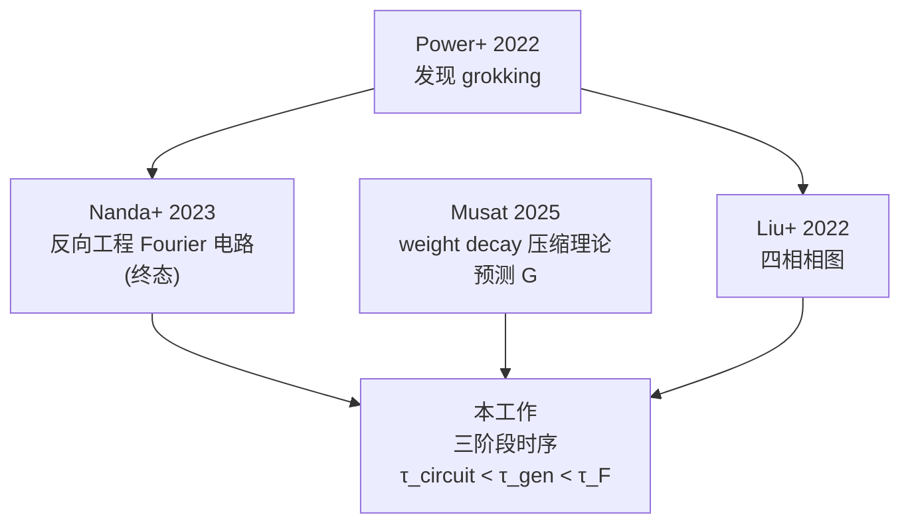

# Grokking 的三阶段图景：通俗版完整笔记

> [!abstract] 一句话总结
> 训练一个小 Transformer 学模运算时，模型不是"突然就会了"，而是经历了**三个清晰的阶段**：
> **(1) 算法在心里搭好** → **(2) 考试开始能做对题** → **(3) 大脑里的那张"圆环"才慢慢显形**。
> 三个阶段相隔大约几千步，加起来约 13000 步。**PCA 里大家爱晒的那个漂亮圆环，其实是第三阶段才出现的"事后产物"，不是 grokking 的原因。**

---

## 一、问题是什么？

### 1.1 什么是 grokking（顿悟）

如果你训练一个小 Transformer 学**模 53 加法**——给定 $a$ 和 $b$，预测 $(a+b) \bmod 53$——会看到一种很奇怪的曲线：

```
训练准确率 (train_acc)：      ~1000 步内冲到 100%
测试准确率 (test_acc)：       接下来 10000–50000 步纹丝不动，停在随机水平
测试准确率 (test_acc)：       某一刻突然跳到 100%
```

> [!info] 通俗讲
> 模型把训练题背得滚瓜烂熟之后，**像睡了好久的午觉**，再醒过来突然就"顿悟"了——能做出从没见过的题。这种"延迟顿悟"现象就叫 grokking。

### 1.2 之前的人发现了什么

- **Power+ 2022** 第一次报告这个奇怪现象。
- **Liu+ 2022** 把它整理成 [[研究说明文档#四相相图|四相相图]]：调 lr 和 wd 两个旋钮，模型会落进 4 个相区之一（理解 / 顿悟 / 记忆 / 混乱）。
- **Nanda+ 2023** 把"顿悟之后"的模型解剖了一遍，发现它内部其实在用**三角函数恒等式**算模运算（叫 **Fourier 电路**）。在 PCA 投影里，那 53 个 token 排成一个漂亮的**圆环**。

### 1.3 我们的问题（论文核心）

Nanda 看的是"顿悟之后的样子"。但**训练过程中**，三个事件谁先谁后？

> [!question] 三个时间戳
> - $\tau_{\text{circuit}}$（**电路时刻**）：模型在 logit 层面上把 Fourier 算法搭起来的步数
> - $\tau_{\text{gen}}$（**泛化时刻**）：测试准确率突然跳到 90% 以上的步数
> - $\tau_F$（**几何时刻**）：token embedding 真正排成 Fourier 圆环的步数
>
> **它们的时间顺序是什么？**

如果**几何先于泛化**（$\tau_F < \tau_{\text{gen}}$，简称 F&lt;G），说明"圆环结构"是 grokking 的原因——大脑先组织好，然后才能做对题。
如果**泛化先于几何**（$\tau_{\text{gen}} < \tau_F$，简称 G&lt;F），说明圆环只是结果——模型先会做题了，画面才慢慢清晰。

---

## 二、为什么这个问题有意思？

> [!tip] 反直觉点
> 很多 mechanistic interpretability（机械可解释性）研究都把"PCA 圆环"当作 grokking 的**视觉标志**。如果它其实是结果而不是原因，那很多基于"几何结构"的解释方向就需要校正。

更具体地说：
- 如果是 F&lt;G —— 我们应该研究 embedding 是怎么"自组织"的，因为那是关键。
- 如果是 G&lt;F —— 真正的关键不在 embedding，**在更上游**（attention 或 MLP 内部），embedding 只是被动跟着变。

---

## 三、关键转折：方法论 pivot

### 3.1 一开始踩的坑

最初的设想很自然：既然 token embedding 应该排成圆环，那就直接量"它有多圆"。这个度量叫 **Circle Score (CS)**：

$$
\text{CS} = \frac{\#\{(i,j,m,n): i+j \equiv m+n,\; |E_i+E_j - E_m-E_n|/\text{norm} < 0.1\}}{\#\text{total quadruples}}
$$

通俗讲：随机抓四个 token，如果它们 i+j ≡ m+n（mod p），那 embedding 应该满足"平行四边形闭合"。CS 就是闭合率。

> [!failure] 实验否决了这个度量
> 跑了 **93 个 run × 50000 步**，结果是：
> - 观察到的最大 CS = **0.019**（需要 0.8 才算"圆"）
> - **0 个 run 越过阈值**
>
> 原因：在 256 维空间里，按这个 tolerance 严格的"平行四边形闭合"几乎几何上不可能。**借来的阈值没法直接搬到我们的设置。**

### 3.2 换一个度量

放弃"圆有多圆"这种几何描述，改用**统计学的变点检测**：

> [!info] 新度量 τ_F
> 1. 对每个训练步，把 token embedding 矩阵做 DFT（离散傅里叶变换）
> 2. 计算"最强单一谐波解释了多少方差"——记作 $F(t)$
> 3. 减去 permutation null（防止高维度下的偶然对齐）：$F_{\text{corr}}(t) = \max(0, F_{\text{raw}}(t) - F_{\text{null}})$
> 4. 在 $F_{\text{corr}}$ 曲线上跑 **BIC 变点检测**，找它"从平到升"的拐点
> 5. 这个拐点就是 $\tau_F$

> [!info] 类似地构造 τ_circuit
> 把同样的流程应用到**模型 logits**（按目标类索引），得到 $\tau_{\text{circuit}}$。
>
> 它衡量的是模型**计算**（而不是 embedding）什么时候开始有 Fourier 结构。

### 3.3 为什么这种度量更可靠

| 维度 | Circle Score (旧) | τ_F (新) |
|---|---|---|
| 阈值来源 | 别人论文（0.8） | 数据自己（BIC 拟合） |
| 高维干扰 | 没处理 | permutation null 校正 |
| 是否会"侦测不到" | 经常（0/93） | 几乎所有 run 都能 |
| 可解释性 | 圆有多圆 | 何时开始集中 |

> [!warning] 一个重要 caveat
> $\tau_F$ 和 $\tau_{\text{circuit}}$ 都是**单频谐波** onset。完整的 Fourier 电路是多频协同的，所以这两个度量是它的**下界 proxy**——它们告诉你"至少在这个时刻，单频结构已经显著"，但完整电路可能更晚才形成。

---

## 四、三阶段图景：核心发现

> [!success] 主结果
> 在 54 个 grokking run 中，**48 个（88.9%）呈完整三阶段排序：**
> $$\tau_{\text{circuit}} < \tau_{\text{gen}} < \tau_F$$
> 三个阶段的间隔大致相等：
> - $\tau_{\text{gen}} - \tau_{\text{circuit}} \approx 6{,}250$ 步
> - $\tau_F - \tau_{\text{gen}} \approx 6{,}000$ 步
> - 总跨度 $\tau_F - \tau_{\text{circuit}} \approx 13{,}000$ 步

通俗讲：

```
[训练开始] ──6.3k步──> [电路搭好] ──6.0k步──> [开始能做对题] ──6.0k步──> [圆环显形]
            stage 1                stage 2                stage 3
```

模型学习就像**装修**：
1. **第一阶段（电路）**：管线、电路、地板都铺好了。算法已经在那里。
2. **第二阶段（泛化）**：通水通电，可以入住了。考试能做对了。
3. **第三阶段（几何）**：开始挂画、摆家具，整个房间"看起来"才像样。这就是 PCA 圆环。

> [!important] 关键论点
> **PCA 中的 Fourier 圆环——大家最爱晒的那张图——反映的是"装修最后一步"。** 它不是模型"会算题"的原因，而是会算题之后顺带把家收拾干净的产物。

---

## 五、实验设计

### 5.1 总体规模

| 实验块 | n（runs）| 主要发现 |
|---|---|---|
| **Pilot 验证**（v3） | 18 | τ_F、τ_gen 度量稳定可用 |
| **Stage 2 wd 扫描** | 30 | 29/30 G&lt;F |
| **Stage 3 lr 扫描** | 30 | 23/25 G&lt;F |
| **Stage 4 三阶段重训** | 60（54 grokking）| 48/54 C&lt;G&lt;F |
| **Stage 5A 乘法** | 30 | **30/30 G&lt;F** |
| **Stage 5B p=97** | 30（21 grokking）| **21/21 G&lt;F** |
| **Stage 6 二维网格** | 147（130 grokking）| 111/130 G&lt;F |
| **敏感性分析** | 8 cells × 36 配置 | 0/8 翻转 |
| **解耦 wd 消融** | — | 验证 wd 因果作用 |

### 5.2 总样本

> [!success] 综合证据
> **236 个 grokking run, 212 个 G&lt;F (89.8%, CI 85.3–93.1%)**
>
> 跨越：两种任务（加法/乘法）+ 两个素数（53/97）+ 一个完整 2D 网格

### 5.3 各设定细节

#### Stage 2：沿 wd 轴细扫
- 固定 lr = 1.6×10⁻³
- wd 取 10 个值：[1.20, 1.35, 1.52, 1.71, 1.93, 2.18, 2.45, 2.76, 3.11, 3.50]
- 3 个 seed
- 结果：**29/30 G&lt;F**，1 个 coincident（同步触发，wd=3.11, seed=2025），**0 个 F&lt;G**
- 总中位 Δ = **+7.8k 步**

#### Stage 3：沿 lr 轴细扫
- 固定 wd = 2.5
- lr 取 10 个值：5×10⁻⁴ 到 8×10⁻³ 对数等距
- 25 个落入 grokking（5 个进入 memorization）
- 结果：**23/25 G&lt;F**，2 个 F&lt;G outliers
- 中位 Δ = +4.0k 步

#### Stage 4：三阶段重训
- 把 Stage 2 + Stage 3 全部 60 个 cell 重训一遍
- 同时记录 F_logit
- 60 个 run 中 54 个落入 grokking（重训方差导致 1 个重新分相）
- 结果：**48/54 完整 C&lt;G&lt;F (88.9%)**
- 6 个例外集中在相边界（lr 极高或极低）

#### Stage 5A：乘法 mod 53
- 乘法 $(a \cdot b) \bmod 53$
- 关键技巧：用**离散对数**（discrete log）重排索引
- 原因：模乘法的群结构是循环群 ℤ/(p-1)ℤ，但 token 索引是 ℤ/pℤ。需要重排才能让"加法 Fourier 度量"看到正确的对称基。
- 结果：**30/30 G&lt;F（100%）**

#### Stage 5B：不同素数 p=97
- 加法 mod 97
- 30 个 run 中 21 个 grokking（9 个进入 comprehension，因为高 wd 下泛化太快）
- 结果：**21/21 G&lt;F（100%）**
- 中位 Δ = **28k 步**（比 p=53 大很多，因为 p 更大→grokking 更慢→consolidation 时间更长）

#### Stage 6：二维网格
- 7×7 网格在 (lr, wd) 平面上
- 147 个 run
- 130 个 grokking
- 结果：**111/130 G&lt;F (85.4%)**
- 14 个 F&lt;G 大多在网格边缘
- 5 个 G_only（τ_F 没检测到）

#### 敏感性分析
- 在 7 个代表性 grokking cell 上跑 detector × 4 EMA × 3 BIC 斜率 × 3 null 间隔 = 36 配置
- 平均 P(G&lt;F) = **0.94**，所有 cell ≥ 0.86
- 8 个 cell 测 raw vs corrected：**0 翻转**

---

## 六、最有意思的几个细节

### 6.1 速度依赖排序假设

> [!tldr] 一句话
> **泛化越慢，越容易出现 F&lt;G。**

少数 F&lt;G 例外几乎都集中在 grokking 相的边界，那里 $\tau_{\text{gen}}$ 异常大。

具体证据：
1. **位置**：所有 F&lt;G outlier 都在边界 cell。
2. **跨任务 pilot**：同样超参数下，**模减法** $(a-b) \bmod 53$ grokking 慢得多（43.5k 步 vs 11k 步），结果落入 F&lt;G。同样超参数、不同 seed 跑得快一点的减法（27.5k 步），又回到 G&lt;F。
3. **聚合相关**：57 个 run 中，$\Delta\tau$ 和 $\tau_{\text{gen}}$ 负相关 $r = -0.62$。所有 F&lt;G run 都满足 $\tau_{\text{gen}} \geq 43000$ 步。

> [!info] 解释
> 想象两个齿轮：
> - 齿轮 A：泛化（由电路动力学决定）
> - 齿轮 B：embedding 几何巩固（由 weight decay 慢慢压缩 embedding 表）
>
> 两个齿轮按各自的钟在转。**A 转得快**（即 $\tau_{\text{gen}}$ 小），就出现 G&lt;F；**A 转得慢**（$\tau_{\text{gen}}$ 大），weight decay 有充分时间先把 embedding 压实，就出现 F&lt;G。

### 6.2 F-only 现象

在某些参数下（特别是 lr 接近相边界），$\tau_F$ 检测到了，但 $\tau_{\text{gen}}$ 永远没出现——**embedding 集中了，模型却没泛化**。

> [!warning] 对核心论点的意义
> 这进一步说明：**Fourier embedding 结构本身既不充分（F-only 不 grok），也不必要（生成在它之前就发生了）**。
> 它是一个**伴随现象**，不是 grokking 的因果因素。

### 6.3 Comprehension 相区在 p=53 下找不到

枚举测了 14 个候选点，没有一个出现 comprehension（同步学习）。
猜测原因：p=53 下训练样本约 840 个，模型容量相对过剩，根本不需要"理解"，直接记忆或顿悟。

p=97 下出现了 9 个 comprehension cell，支持这个猜测。

### 6.4 跨 prime 缩放

| Setting | 中位 Δτ | 说明 |
|---|---|---|
| p=53 add | ~6–7k 步 | 小素数 |
| p=53 mul (dlog) | ~9k 步 | 类似规模 |
| p=97 add | **~28k 步** | 大素数，grokking 慢，consolidation 期更长 |

**滞后量随任务变化，但排序保持不变。**

---

## 七、与文献的关系



> [!quote] 本工作的定位
> - **Nanda 2023** 描述 grokking 的**终态**（"圆环长这样"）
> - **本工作**描述 grokking 的**过程**（"圆环什么时候出现"），且发现**它最后才出现**
> - **Musat 2025** 从理论上预测 weight decay 驱动 embedding 滞后形成；本工作的 G&lt;F 是这个预测的直接实验验证

### 与其他方向的连接

- **Lazy → rich 转变**（Kumar+ 2024）：可以解释 $\tau_{\text{gen}}$ 到 $\tau_F$ 的延迟——网络从"懒"模式切换到"特征学习"模式需要时间。
- **Sparse vs dense 子网络竞争**（Merrill+ 2023）：可以解释 C&lt;G——稀疏的 generalising 电路在被记忆电路压制的情况下逐渐胜出。
- **Superposition**（Elhage+ 2022）：在 C&lt;G 窗口内，电路已经在跑，但 embedding 还在"多义态"中。$\tau_F$ 标志的是**单义化**完成。

---

## 八、局限性（论文承认的）

> [!failure] Limitations 一览

1. **任务范围**：只测了模加法和模乘法 mod 53/97。能不能推广到非模运算、更深架构、非算法任务，未知。
2. **测量分辨率**：500 步分辨率，$|\Delta\tau| \lesssim 500$ 没法可靠分类。
3. **单频度量**：$\tau_F, \tau_{\text{circuit}}$ 是单频 proxy，不等于完整多频电路。
4. **相边界检测**：4 个 G&lt;C&lt;F 例外都在 lr 极高处，可能是 BIC 检测分辨率不足，而不是真正的 G&lt;C 排序。
5. **循环群结构假设**：度量基于 ℤ/p。换成非循环群结构的算法可能完全检测不到。
6. **统计假设**：BIC 假设 i.i.d. 高斯残差；run 之间的依赖性没正式检验。
7. **检测器规格范围**：扫了三个旋钮，但有限对抗式检测器没法穷尽。

---

## 九、结论与含义

### 9.1 核心 take-away

> [!success] 论文最想让你记住的
> 1. **Grokking 不是一个事件，是一个三阶段过程：电路 → 泛化 → 几何**。
> 2. **PCA 圆环是结果而非原因**：它在第三阶段才显现，不能解释 grokking。
> 3. **方法论教训**：借来的阈值（如 Circle Score = 0.8）不能直接搬，需要本地验证；首选有统计基础的检测方法（BIC + null correction）。

### 9.2 对可解释性研究的启示

> [!tip] 实践含义
> - 在更大模型上做"几何可解释性"（线性探针、字典学习、特征可视化）时，**电路可能已经稳定，但几何还在 polysemantic 状态**。这两件事的时间错位会一直困扰大模型解释工作。
> - 想理解 grokking 的**机制原因**，不应该看 token embedding 几何，应该看 attention 模式 / MLP 内部 / 非主导 Fourier 分量等更上游的特征。

### 9.3 未解决的开放问题

1. **完整多频电路** vs 单频 proxy：两者完全等价吗？
2. **真正最早的信号**在哪里？$\tau_{\text{circuit}}$ 之前模型已经在做什么？
3. **速度依赖假设**的因果验证：能否独立操控泛化速度（不改 lr/wd）来确认 F&lt;G 是速度依赖的？
4. **不同任务**：非模运算的 grokking 任务上，三阶段图景还成立吗？
5. **大模型**：embedding consolidation 这一阶段在 LLM 上还有意义吗？

---

## 十、相关材料

- 论文 LaTeX：`paper/main.tex`
- 实验进度：[[实验进度]]
- 研究总览：[[研究总览]]
- 详细研究日志：[[研究说明文档]]
- 代码：`grok_metrics.py`、`stage{0..6}_*.py`
- 数据：`runs/` · 图表：`paper/figures/`

---

> [!note] 这份笔记的目的
> 这份笔记是给"懂一点深度学习但没读过论文"的人准备的入门读本。所有专有名词在第一次出现时都用通俗类比解释了一遍。
> 如果你需要严格的统计/数学定义，请回到 `paper/main.tex`。
